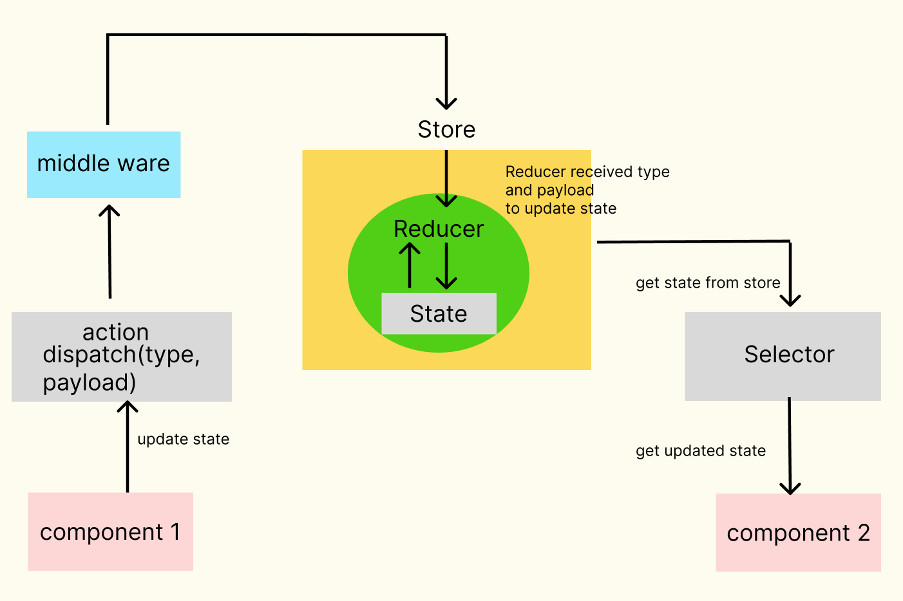

Redux is one of the most used libraries in state management for React applications, it helps us centralize data management.

### **- What is state management?**

State management allows multiple components to share data within the same application. Each component can read and modify the application state as required.

### **- Why do we need to centrally manage data?**

In a simple React app, it is easy to follow the "one-way data flow" rule. However, in a more complex app with many components located in different parts of the app, managing data can become difficult. It is much easier for developers to manage all the data if there is a place to store and update all the data, and all components can directly ac-cess the data.

### **- Main components of Redux:**

1. **Store**: an object that holds the entire state tree of your ap-plication;

2. **Reducer**: a function that receives an action to update state and returns a new state;
3. **Action**: an object that tells the reducer how to change the state. It contains a type and payload;

4. **Selector**: a function that accepts the Redux store state as arguments and returns data based on that state.

### **- How does Redux update state?**

The process is shown in the following diagram:

